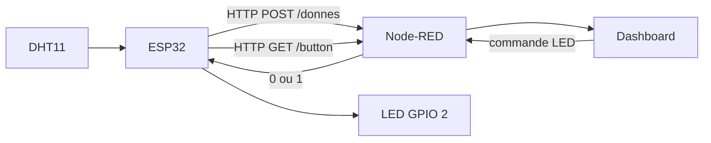
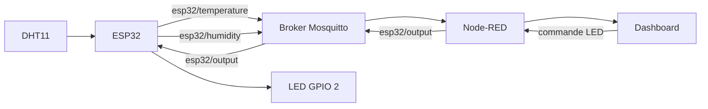

# TP1 IoT - ESP32, DHT11, Node-RED, HTTP REST et MQTT

Ce dépôt regroupe mon travail réalisé dans le cadre du **TP1 d'IoT** consacré à la communication bidirectionnelle entre un **ESP32**, un **capteur DHT11** et une interface **Node-RED**.

L'objectif était de mettre en œuvre et de comparer deux méthodes de communication couramment utilisées en IoT :

- **HTTP REST** ;
- **MQTT**, avec un broker **Eclipse Mosquitto**.

Le système doit fonctionner dans les deux sens :

- **Uplink** : l'ESP32 lit la température et l'humidité du DHT11 puis transmet ces mesures vers Node-RED pour les afficher ;
- **Downlink** : une commande envoyée depuis l'interface Node-RED permet de modifier l'état de la LED intégrée à l'ESP32.

## Sommaire

- [1. Objectifs du TP](#1-objectifs-du-tp)
- [2. Matériel et logiciels utilisés](#2-matériel-et-logiciels-utilisés)
- [3. Organisation du dépôt](#3-organisation-du-dépôt)
- [4. Démarche suivie](#4-démarche-suivie)
- [5. Lecture du DHT11](#5-lecture-du-dht11)
- [6. Communication HTTP REST](#6-communication-http-rest)
- [7. Node-RED avec REST](#7-node-red-avec-rest)
- [8. Communication MQTT](#8-communication-mqtt)
- [9. Mosquitto et tests MQTT](#9-mosquitto-et-tests-mqtt)
- [10. Explication des principales parties du code](#10-explication-des-principales-parties-du-code)
- [11. Comparaison REST et MQTT](#11-comparaison-rest-et-mqtt)
- [12. Lancer le projet](#12-lancer-le-projet)
- [13. Importer le flow Node-RED](#13-importer-le-flow-node-red)
- [14. Corrections et points à vérifier](#14-corrections-et-points-à-vérifier)
- [15. Sécurité avant publication sur GitHub](#15-sécurité-avant-publication-sur-github)
- [16. Publier le projet sur GitHub](#16-publier-le-projet-sur-github)
- [17. Conclusion](#17-conclusion)
- [18. Références](#18-références)

---

# 1. Objectifs du TP

Le sujet demandait de réaliser deux démonstrations de communication bidirectionnelle.

### Architecture HTTP REST

L'ESP32 doit :

1. lire la température et l'humidité avec le DHT11 ;
2. envoyer ces informations à Node-RED avec une requête **HTTP POST** ;
3. récupérer l'état demandé pour la LED avec une requête **HTTP GET**.

Node-RED doit :

1. recevoir les données envoyées par l'ESP32 ;
2. afficher les mesures sur un tableau de bord ;
3. proposer une commande permettant d'allumer ou d'éteindre la LED.

### Architecture MQTT

L'ESP32 doit :

1. se connecter au broker Mosquitto ;
2. publier la température et l'humidité dans des **topics MQTT** ;
3. s'abonner à un topic de commande de la LED.

Node-RED peut alors publier et souscrire aux mêmes topics via le broker.

---

# 2. Matériel et logiciels utilisés

## Matériel

- ESP32 **DOIT ESP32 DEVKIT V1** ;
- capteur de température et d'humidité **DHT11** ;
- LED intégrée de l'ESP32, utilisée sur le **GPIO 2** dans mon programme ;
- câbles de connexion ;
- ordinateur connecté au même réseau local que l'ESP32.

## Logiciels

- **Visual Studio Code** ;
- **PlatformIO** ;
- framework **Arduino** pour ESP32 ;
- **Node-RED** ;
- **node-red-dashboard 3.6.6** pour l'interface graphique du flow fourni ;
- **Eclipse Mosquitto** comme broker MQTT ;
- bibliothèque **Adafruit DHT sensor library** ;
- bibliothèque **PubSubClient** pour MQTT.

> Le paquet historique `node-red-dashboard` utilisé dans ce TP est aujourd'hui déprécié, mais la version 3.6.6 correspond au flow présent dans ce dépôt et reste utile pour reproduire le TP. Pour un nouveau projet de production, il est préférable d'utiliser une solution maintenue comme FlowFuse Dashboard.

---

# 3. Organisation du dépôt

Le travail a été construit progressivement. J'ai conservé plusieurs projets PlatformIO afin de montrer les différentes étapes.

```text
TP1/
|
|-- Esp32_DHt_11/
|   |-- platformio.ini
|   `-- src/main.cpp
|
|-- Esp32_to_Node_red/
|   |-- platformio.ini
|   `-- src/main.cpp
|
|-- Esp32_to_Node_red_et_DHT11/
|   |-- platformio.ini
|   `-- src/main.cpp
|
|-- Esp32_to_Mosquitto_et_DHT11/
|   |-- platformio.ini
|   `-- src/main.cpp
|
|-- Node_red_architecture/
|   `-- flow_cpt_hum_temp_dashboard.json
|
|-- DHT-11_datasheet.pdf
|-- TP1_architecture_REST-MQTT_2026.pdf
|-- Tutorial_Getting_Started_ESP32.pdf
|-- git_push.bat
`-- .gitignore
```

### Rôle de chaque projet

| Dossier                         | Rôle                                                                                                                            |
| ------------------------------- | -------------------------------------------------------------------------------------------------------------------------------- |
| `Esp32_DHt_11`                | Première étape : lecture locale du capteur DHT11 et affichage dans le moniteur série.                                         |
| `Esp32_to_Node_red`           | Test de communication HTTP entre l'ESP32 et Node-RED avec un compteur.                                                           |
| `Esp32_to_Node_red_et_DHT11`  | Version REST : envoi du compteur, de la température et de l'humidité par POST, puis récupération d'une commande LED par GET. |
| `Esp32_to_Mosquitto_et_DHT11` | Version MQTT : publication des mesures et abonnement au topic de commande de la LED.                                             |
| `Node_red_architecture`       | Export JSON du flow Node-RED présent dans le dépôt.                                                                           |

Cette organisation permet de voir l'évolution du projet au lieu d'avoir directement un programme final difficile à déboguer.

---

# 4. Démarche suivie

J'ai volontairement avancé par étapes afin de tester chaque fonction indépendamment.

## Étape 1 - Faire fonctionner l'ESP32

J'ai d'abord vérifié :

- la compilation avec PlatformIO ;
- le téléversement sur la carte ;
- le fonctionnement du moniteur série ;
- la LED intégrée.

## Étape 2 - Lire le DHT11

J'ai ensuite connecté le DHT11 à l'ESP32 et utilisé la bibliothèque Adafruit DHT afin de récupérer :

- la température en degrés Celsius ;
- l'humidité relative en pourcentage.

Les valeurs ont d'abord été affichées uniquement dans le moniteur série.

## Étape 3 - Tester HTTP avec une donnée simple

Avant d'envoyer les mesures du capteur, j'ai testé la communication ESP32 -> Node-RED avec un simple compteur.

Cette étape m'a permis de vérifier séparément :

- la connexion Wi-Fi ;
- l'adresse IP du PC ;
- le port `1880` de Node-RED ;
- la route HTTP ;
- la réception d'une requête POST.

## Étape 4 - Ajouter les mesures DHT11 à la requête REST

Une fois le POST validé, j'ai envoyé plusieurs champs dans une seule requête :

```text
compteur=42&hum=55.0&temp=23.4
```

Le contenu est envoyé avec le type :

```text
application/x-www-form-urlencoded
```

## Étape 5 - Ajouter le downlink REST

Pour commander la LED dans l'autre sens, l'ESP32 effectue une requête **GET** vers Node-RED.

Node-RED doit répondre :

```text
1
```

pour allumer la LED, ou :

```text
0
```

pour l'éteindre.

## Étape 6 - Refaire le système avec MQTT

Enfin, j'ai remplacé la logique REST par une architecture MQTT :

- Mosquitto joue le rôle de broker ;
- l'ESP32 publie ses mesures ;
- l'ESP32 s'abonne au topic de commande de la LED ;
- Node-RED peut lui aussi publier et souscrire aux topics.

---

# 5. Lecture du DHT11

Le projet correspondant est :

```text
Esp32_DHt_11/
```

Dans `platformio.ini`, la bibliothèque DHT est déclarée dans `lib_deps` :

```ini
lib_deps = adafruit/DHT sensor library@^1.4.7
```

PlatformIO peut donc télécharger automatiquement la dépendance nécessaire lors de la compilation.

Dans le programme :

```cpp
#define DHTPIN 4
#define DHTTYPE DHT11
DHT dht(DHTPIN, DHTTYPE);
```

Cela signifie que :

- le signal du capteur est relié au **GPIO 4** ;
- le type de capteur est un **DHT11** ;
- l'objet `dht` représente le capteur dans le programme.

Dans `setup()` :

```cpp
dht.begin();
```

initialise le capteur.

Les deux fonctions principales utilisées sont :

```cpp
dht.readTemperature();
dht.readHumidity();
```

Elles permettent respectivement de récupérer la température et l'humidité.

---

# 6. Communication HTTP REST

## Architecture générale



Dans cette architecture, l'ESP32 est principalement le **client HTTP** et Node-RED joue le rôle de **serveur HTTP local**.

## Connexion Wi-Fi

Le programme configure l'ESP32 en mode station :

```cpp
WiFi.mode(WIFI_STA);
WiFi.begin(ssid, password);
```

Le mode `WIFI_STA` signifie que l'ESP32 rejoint un réseau Wi-Fi existant comme n'importe quel client.

Le programme attend ensuite que la connexion soit établie et affiche l'adresse IP obtenue :

```cpp
Serial.println(WiFi.localIP());
```

L'ESP32 et l'ordinateur exécutant Node-RED doivent être joignables sur le même réseau local.

## Envoi des données avec POST

Dans la version REST complète, les données sont regroupées dans une chaîne :

```cpp
String httpRequestData =
    "compteur=" + String(compteur) +
    "&hum=" + String(humidite, 1) +
    "&temp=" + String(temperature, 1);
```

Exemple de contenu envoyé :

```text
compteur=27&hum=48.0&temp=22.6
```

Puis j'indique le type de contenu :

```cpp
httpPOST.addHeader(
    "Content-Type",
    "application/x-www-form-urlencoded"
);
```

La requête est envoyée avec :

```cpp
int httpResponseCode = httpPOST.POST(httpRequestData);
```

Le code HTTP retourné permet de savoir si Node-RED a bien répondu. Un code `200` signifie que la requête a été correctement traitée.

Après la requête :

```cpp
httpPOST.end();
```

libère les ressources utilisées par le client HTTP.

## Réception de la commande LED avec GET

L'ESP32 interroge également une route Node-RED :

```cpp
int getResponseCode = httpGET.GET();
```

Puis il récupère le corps de la réponse :

```cpp
String etatLED = httpGET.getString();
```

Enfin :

```cpp
if (etatLED == "1")
{
    digitalWrite(LED_PIN, HIGH);
}
else if (etatLED == "0")
{
    digitalWrite(LED_PIN, LOW);
}
```

La chaîne reçue est donc transformée en action physique sur la LED.

---

# 7. Node-RED avec REST

Le flow exporté se trouve dans :

```text
Node_red_architecture/flow_cpt_hum_temp_dashboard.json
```

## Réception des données

Le flow contient un nœud **HTTP In** configuré en POST sur la route des données.

Lorsqu'une requête `application/x-www-form-urlencoded` est reçue, Node-RED place les champs dans :

```javascript
msg.payload
```

On peut alors retrouver :

```javascript
msg.payload.temp
msg.payload.hum
msg.payload.compteur
```

## Extraction des valeurs

Trois nœuds `function` sont utilisés pour isoler les données avant de les transmettre aux graphiques.

### Température

```javascript
msg.payload = msg.payload.temp;
return msg;
```

### Humidité

```javascript
msg.payload = msg.payload.hum;
return msg;
```

### Compteur

```javascript
msg.payload = msg.payload.compteur;
return msg;
```

Le principe est important : dans Node-RED, le message circule de nœud en nœud dans l'objet `msg`. La propriété `msg.payload` est couramment utilisée pour transporter la donnée principale.

## Réponse HTTP

Le flow contient aussi un nœud **HTTP Response** configuré en `200` afin de terminer correctement la requête reçue depuis l'ESP32.

Sans nœud `HTTP Response`, le client ESP32 pourrait attendre une réponse ou finir par rencontrer un timeout.

## Dashboard

Le flow contient trois graphiques :

- température ;
- humidité ;
- compteur.

Ils permettent de visualiser l'évolution des données reçues en temps réel.

### Important concernant le flow fourni

L'export JSON actuellement présent dans le dépôt contient bien la partie **POST + graphiques**, mais il ne contient pas le flow complet du **GET `/button`** ni la partie **MQTT**.

Avant de considérer le dépôt comme le livrable final du TP, il faut donc réexporter depuis Node-RED le flow complet utilisé pendant la démonstration si ces nœuds existent dans ton environnement local.

---

# 8. Communication MQTT

Le projet correspondant est :

```text
Esp32_to_Mosquitto_et_DHT11/
```

## Architecture générale



Contrairement à REST, l'ESP32 et Node-RED ne communiquent pas directement l'un avec l'autre. Ils communiquent avec un **broker MQTT**.

Le broker reçoit les messages publiés puis les transmet aux clients abonnés aux topics correspondants.

## Création du client MQTT

Le programme utilise :

```cpp
WiFiClient espClient;
PubSubClient client(espClient);
```

`WiFiClient` fournit la connexion réseau TCP et `PubSubClient` ajoute le protocole MQTT par-dessus.

## Adresse du broker

Le broker est défini avec son adresse IP :

```cpp
const char *mqtt_server = "IP_DU_PC";
```

Puis :

```cpp
client.setServer(mqtt_server, 1883);
```

Le port MQTT non chiffré utilisé pour ce TP est `1883`.

## Topics utilisés

| Topic                 | Sens            | Contenu                                   |
| --------------------- | --------------- | ----------------------------------------- |
| `esp32/temperature` | ESP32 -> broker | température du DHT11                     |
| `esp32/humidity`    | ESP32 -> broker | humidité du DHT11                        |
| `esp32/output`      | broker -> ESP32 | commande`true` ou `false` pour la LED |

## Publication des mesures

Les mesures DHT11 sont des nombres flottants. Le code utilise `dtostrf()` pour les convertir en tableaux de caractères avant publication :

```cpp
char tempString[8];
dtostrf(temperature, 1, 2, tempString);
client.publish("esp32/temperature", tempString);
```

Même principe pour l'humidité :

```cpp
char humString[8];
dtostrf(humidite, 1, 2, humString);
client.publish("esp32/humidity", humString);
```

## Temporisation avec `millis()`

Le code utilise :

```cpp
long now = millis();
if (now - lastMsg > 500)
```

`millis()` retourne le nombre de millisecondes écoulées depuis le démarrage de l'ESP32.

Cette méthode permet de savoir quand envoyer une nouvelle mesure sans se baser uniquement sur une temporisation bloquante.

## Abonnement au topic de commande

Après connexion au broker :

```cpp
client.subscribe("esp32/output");
```

L'ESP32 demande ainsi à recevoir les messages publiés sur ce topic.

La fonction :

```cpp
client.loop();
```

est importante car elle entretient la connexion MQTT et permet de traiter les messages entrants.

## Fonction `callback()`

La fonction de callback est appelée lorsqu'un message MQTT correspondant à un abonnement arrive.

Elle récupère :

- le nom du topic ;
- le tableau d'octets contenant le message ;
- la longueur du message.

Le programme reconstruit le texte reçu :

```cpp
String messageTemp;

for (int i = 0; i < length; i++)
{
    messageTemp += (char)message[i];
}
```

Puis vérifie le topic :

```cpp
if (String(topic) == "esp32/output")
```

et commande la LED :

```cpp
if (messageTemp == "true")
{
    digitalWrite(LED_PIN, HIGH);
}
else if (messageTemp == "false")
{
    digitalWrite(LED_PIN, LOW);
}
```

## Reconnexion MQTT

La fonction `reconnect()` vérifie que l'ESP32 est connecté au broker.

En cas de perte de connexion, elle tente une reconnexion :

```cpp
if (client.connect("ESP32Client_Youssef"))
```

Puis elle se réabonne au topic de commande :

```cpp
client.subscribe("esp32/output");
```

C'est important, car après une reconnexion le client doit retrouver les abonnements nécessaires au fonctionnement du système.

---

# 9. Mosquitto et tests MQTT

Mosquitto est le broker MQTT utilisé localement sur le PC.

Sous Windows, j'ai lancé le broker depuis son dossier d'installation avec une configuration dédiée :

```bat
cd /d "C:\Program Files\mosquitto"
mosquitto.exe -c "C:\Program Files\mosquitto\mosquitto.conf" -v
```

L'option `-v` affiche les connexions et messages dans le terminal, ce qui est très pratique pour le débogage.

## Vérifier les publications de l'ESP32

Depuis un second terminal :

```bat
mosquitto_sub.exe -h localhost -p 1883 -t "esp32/#" -v
```

Le caractère `#` signifie que l'on souhaite recevoir tous les sous-topics sous `esp32/`.

On doit par exemple voir :

```text
esp32/temperature 22.50
esp32/humidity 51.00
```

## Tester la LED sans Node-RED

On peut également publier manuellement une commande :

```bat
mosquitto_pub.exe -h localhost -p 1883 -t "esp32/output" -m "true"
```

Puis :

```bat
mosquitto_pub.exe -h localhost -p 1883 -t "esp32/output" -m "false"
```

Cela permet de vérifier séparément la partie MQTT de l'ESP32 avant d'ajouter Node-RED.

> Le broker doit être accessible depuis l'adresse IP du PC sur le réseau local. Une configuration Mosquitto ou le pare-feu Windows peut empêcher les connexions provenant de l'ESP32. Ne pas exposer un broker anonyme sur Internet.

---

# 10. Explication des principales parties du code

## `setup()`

La fonction `setup()` est exécutée une seule fois au démarrage ou après un reset.

Dans ce TP, elle sert notamment à :

- démarrer le port série ;
- initialiser le DHT11 ;
- configurer la LED en sortie ;
- se connecter au Wi-Fi ;
- initialiser le client MQTT dans la version MQTT.

## `loop()`

La fonction `loop()` est exécutée en permanence.

Elle permet de :

- lire le capteur ;
- envoyer les données ;
- récupérer une commande ;
- maintenir la connexion MQTT ;
- recommencer le cycle.

## `Serial.begin(...)`

Exemple :

```cpp
Serial.begin(9600);
```

Cette instruction initialise la liaison série avec le PC.

La valeur choisie doit correspondre au `monitor_speed` configuré dans `platformio.ini`.

## `pinMode()`

```cpp
pinMode(LED_PIN, OUTPUT);
```

configure la broche comme une sortie numérique.

## `digitalWrite()`

```cpp
digitalWrite(LED_PIN, HIGH);
```

met la sortie à l'état haut.

```cpp
digitalWrite(LED_PIN, LOW);
```

la met à l'état bas.

## `#define MON_TELEPHONE` et `#ifdef`

J'ai utilisé la compilation conditionnelle pour pouvoir basculer entre plusieurs configurations réseau sans réécrire tout le programme.

Principe :

```cpp
#define MON_TELEPHONE
// #define MA_FREEBOX
```

puis :

```cpp
#ifdef MON_TELEPHONE
// configuration 1
#endif

#ifdef MA_FREEBOX
// configuration 2
#endif
```

Une seule configuration doit être activée à la fois.

Pour un dépôt GitHub public, les mots de passe ne doivent cependant pas être écrits directement dans ces blocs.

## `WiFi.setHostname()`

```cpp
WiFi.setHostname(name_card_elec);
```

permet de donner un nom à la carte sur le réseau local.

## `HTTPClient`

Cette classe est utilisée dans l'architecture REST :

```cpp
HTTPClient httpPOST;
```

Puis :

```cpp
httpPOST.begin(serverPOST.c_str());
```

associe le client à l'URL du serveur Node-RED.

## `WiFiClient` + `PubSubClient`

Dans MQTT :

```cpp
WiFiClient espClient;
PubSubClient client(espClient);
```

Le premier gère la communication réseau, le second fournit les fonctions MQTT telles que :

```cpp
client.connect(...);
client.publish(...);
client.subscribe(...);
client.loop();
```

---

# 11. Comparaison REST et MQTT

| Critère                      | HTTP REST                                    | MQTT                                               |
| ----------------------------- | -------------------------------------------- | -------------------------------------------------- |
| Modèle                       | Requête / réponse                          | Publication / abonnement                           |
| Intermédiaire                | Node-RED agit directement comme serveur HTTP | Broker Mosquitto                                   |
| Envoi ESP32 -> serveur        | POST                                         | `publish()`                                      |
| Commande serveur -> ESP32     | GET périodique dans cette implémentation   | message envoyé directement au topic abonné       |
| Adressage                     | URL / endpoint                               | topic                                              |
| Mise en œuvre                | Très intuitive pour une API web             | Demande un broker et une logique publish/subscribe |
| IoT avec beaucoup de messages | Possible, mais plus verbeux                  | Généralement très adapté                       |
| Réactivité du downlink      | Dépend du rythme des GET                    | Très naturelle avec l'abonnement                  |
| Débogage                     | codes HTTP, navigateur, Postman, logs        | `mosquitto_sub`, logs du broker, topics          |

## Ce que j'ai retenu

REST est simple à comprendre car chaque échange est associé à une URL et à une méthode HTTP. Il fonctionne très bien pour communiquer avec une API.

MQTT est particulièrement intéressant en IoT parce qu'un équipement peut publier une information sans connaître directement tous ses destinataires. Le broker se charge de redistribuer les messages aux clients abonnés.

Pour le downlink de ce TP, MQTT est également plus naturel : l'ESP32 reçoit le message dès qu'il est publié, alors que ma version REST interroge régulièrement Node-RED avec un GET.

---

# 12. Lancer le projet

## Prérequis

Installer :

1. Visual Studio Code ;
2. l'extension PlatformIO ;
3. Node.js et Node-RED ;
4. Mosquitto pour la partie MQTT.

## Node-RED

Installation globale avec npm :

```powershell
npm install -g node-red
```

Pour reproduire exactement le dashboard du flow fourni :

```powershell
cd $env:USERPROFILE\.node-red
npm install node-red-dashboard@3.6.6
```

Démarrer Node-RED :

```powershell
node-red
```

L'éditeur est ensuite accessible localement sur :

```text
http://127.0.0.1:1880
```

Avec le dashboard historique, l'interface est généralement accessible sur :

```text
http://127.0.0.1:1880/ui
```

## PlatformIO

Chaque dossier ESP32 est un projet PlatformIO indépendant.

Il faut donc ouvrir dans VS Code le dossier que l'on souhaite compiler, par exemple :

```text
Esp32_to_Mosquitto_et_DHT11
```

PlatformIO utilise le fichier `platformio.ini` pour connaître :

- la plateforme ;
- la carte ;
- le framework ;
- la vitesse du moniteur série ;
- les bibliothèques nécessaires.

Exemple :

```ini
[env:esp32doit-devkit-v1]
platform = espressif32
board = esp32doit-devkit-v1
framework = arduino
monitor_speed = 9600
lib_deps =
    adafruit/DHT sensor library@^1.4.7
    https://github.com/knolleary/pubsubclient
```

Avec PlatformIO CLI, les commandes équivalentes sont :

```powershell
pio run
pio run -t upload
pio device monitor
```

---

# 13. Importer le flow Node-RED

Le flow fourni est :

```text
Node_red_architecture/flow_cpt_hum_temp_dashboard.json
```

Dans Node-RED :

1. ouvrir l'éditeur ;
2. cliquer sur le menu en haut à droite ;
3. choisir **Import** ;
4. choisir le fichier JSON ou copier son contenu ;
5. importer le flow ;
6. cliquer sur **Deploy**.

Si les nœuds `ui_chart`, `ui_group` ou `ui_tab` sont inconnus, installer le paquet :

```powershell
cd $env:USERPROFILE\.node-red
npm install node-red-dashboard@3.6.6
```

puis redémarrer Node-RED.

---

# 14. Corrections et points à vérifier

En relisant le projet complet avant publication, j'ai identifié plusieurs points à vérifier.

## 1. Température et humidité inversées dans la version REST

Dans `Esp32_to_Node_red_et_DHT11/src/main.cpp`, la version actuelle contient :

```cpp
float humidite = dht.readTemperature();
float temperature = dht.readHumidity();
```

Les noms des variables sont inversés.

La version correcte est :

```cpp
float temperature = dht.readTemperature();
float humidite = dht.readHumidity();
```

Sinon, le graphique nommé température affiche en réalité l'humidité, et inversement.

## 2. Flow Node-RED incomplet dans l'export actuel

Le fichier JSON fourni contient :

- le POST de réception ;
- les fonctions d'extraction ;
- les graphiques température, humidité et compteur.

En revanche, l'export ne contient pas actuellement :

- la route GET utilisée pour la LED REST ;
- le bouton associé ;
- les nœuds MQTT ;
- le dashboard MQTT.

Il faut donc exporter le flow final depuis la machine de TP pour que le dépôt représente la démonstration complète demandée par le sujet.

## 3. Fichiers inutiles

Le dépôt contient plusieurs fichiers `desktop.ini` ainsi qu'un raccourci Windows `.lnk`.

Ils ne sont pas utiles au projet et peuvent être ignorés avec Git.

Le fichier `.gitignore` racine contient déjà :

```gitignore
desktop.ini
```

On peut l'améliorer avec :

```gitignore
# Windows
desktop.ini
Thumbs.db
*.lnk

# PlatformIO
.pio/

# VS Code / PlatformIO généré
.vscode/.browse.c_cpp.db*
.vscode/c_cpp_properties.json
.vscode/launch.json
.vscode/ipch

# Secrets locaux
**/src/secrets.h
```

## 4. Dossier `.pio`

Un dossier `.pio` est présent dans une copie locale du projet MQTT. Il contient des fichiers générés et des dépendances téléchargées par PlatformIO.

Il n'est pas nécessaire de le publier : `platformio.ini` suffit à recréer l'environnement.

## 5. Archive ZIP en double

Le dépôt contient également :

```text
Esp32_to_Node_red_et_DHT11.zip
```

Comme le dossier décompressé existe déjà, cette archive est optionnelle et peut être retirée pour alléger le dépôt.

---

# 15. Sécurité avant publication sur GitHub

## Ne pas publier les mots de passe Wi-Fi

Dans les fichiers d'origine, les identifiants Wi-Fi sont écrits directement dans `main.cpp`.

Il ne faut pas publier ces valeurs dans un dépôt public.

Une solution simple consiste à créer :

```text
src/secrets.h
```

avec :

```cpp
#pragma once

#define WIFI_SSID "MON_WIFI"
#define WIFI_PASSWORD "MON_MOT_DE_PASSE"
#define SERVER_IP "192.168.x.x"
```

Puis dans `main.cpp` :

```cpp
#include "secrets.h"

const char *ssid = WIFI_SSID;
const char *password = WIFI_PASSWORD;
```

Ajouter ensuite dans `.gitignore` :

```gitignore
**/src/secrets.h
```

Pour montrer la structure aux autres personnes sans publier les vraies valeurs, on peut créer un fichier :

```text
src/secrets.example.h
```

contenant uniquement des valeurs fictives :

```cpp
#pragma once

#define WIFI_SSID "VOTRE_SSID"
#define WIFI_PASSWORD "VOTRE_MOT_DE_PASSE"
#define SERVER_IP "192.168.1.100"
```

### Important

Si un mot de passe ou une clé a déjà été envoyé dans l'historique d'un dépôt public, le supprimer uniquement du dernier fichier ne suffit pas. Il faut considérer le secret comme compromis, le remplacer et éventuellement nettoyer l'historique Git.

---

# 16. Publier le projet sur GitHub

## Étape 1 - Nettoyer le dossier

Avant le premier commit :

- retirer les identifiants Wi-Fi ;
- vérifier `.gitignore` ;
- ne pas versionner `.pio` ;
- supprimer les fichiers Windows inutiles si nécessaire ;
- ajouter ce `README.md` à la racine.

## Étape 2 - Créer le dépôt Git local

Depuis PowerShell, se placer à la racine du TP :

```powershell
cd "C:\CHEMIN\VERS\TP1"
```

Puis :

```powershell
git init -b main
git add .
git status
git commit -m "Initial commit - TP IoT ESP32 REST MQTT"
```

La commande :

```powershell
git status
```

est particulièrement importante avant le commit. Elle permet de vérifier qu'aucun fichier sensible ou inutile n'est sur le point d'être envoyé.

## Étape 3 - Créer le dépôt sur GitHub

Sur GitHub :

1. cliquer sur **New repository** ;
2. choisir par exemple le nom :

```text
TP-IoT-ESP32-REST-MQTT
```

3. choisir `Public` ou `Private` ;
4. ne pas ajouter un autre README si le dossier local en contient déjà un ;
5. créer le dépôt.

## Étape 4 - Relier le dépôt local à GitHub

GitHub fournit une URL ressemblant à :

```text
https://github.com/VOTRE-UTILISATEUR/TP-IoT-ESP32-REST-MQTT.git
```

Ajouter le remote :

```powershell
git remote add origin https://github.com/VOTRE-UTILISATEUR/TP-IoT-ESP32-REST-MQTT.git
```

Vérifier :

```powershell
git remote -v
```

Puis publier :

```powershell
git push -u origin main
```

## Pour les modifications suivantes

Le cycle normal devient :

```powershell
git status
git add .
git commit -m "Description de la modification"
git push
```

Le fichier `git_push.bat` présent dans ce projet automatise une partie de cette séquence, mais il est préférable de vérifier `git status` et de choisir un message de commit adapté à chaque modification.

---

# 17. Conclusion

Ce TP m'a permis de mettre en œuvre une chaîne IoT complète allant d'un capteur physique jusqu'à une interface web.

J'ai commencé par valider séparément chaque élément :

1. lecture du DHT11 ;
2. connexion Wi-Fi ;
3. communication HTTP simple ;
4. transmission de plusieurs mesures vers Node-RED ;
5. commande bidirectionnelle avec REST ;
6. mise en place d'un broker Mosquitto ;
7. publication et abonnement MQTT ;
8. commande de la LED à distance.

Cette progression m'a permis de mieux comprendre la différence entre une architecture **requête/réponse** avec REST et une architecture **publish/subscribe** avec MQTT.

Pour un système IoT simple, REST est facile à mettre en œuvre et à déboguer. MQTT apporte cependant une architecture particulièrement adaptée aux équipements connectés lorsque plusieurs clients doivent échanger des données de manière asynchrone via des topics.

---

# 18. Références

- Sujet du TP : `TP1_architecture_REST-MQTT_2026.pdf`
- Documentation DHT11 fournie : `DHT-11_datasheet.pdf`
- Tutoriel ESP32 fourni : `Tutorial_Getting_Started_ESP32.pdf`
- PlatformIO - configuration `platformio.ini` : https://docs.platformio.org/en/stable/projectconf/index.html
- PlatformIO - `lib_deps` : https://docs.platformio.org/en/latest/projectconf/sections/env/options/library/lib_deps.html
- Node-RED : https://nodered.org/
- Node-RED Dashboard 3.6.6 : https://flows.nodered.org/node/node-red-dashboard
- Eclipse Mosquitto : https://mosquitto.org/
- Mosquitto `mosquitto_sub` : https://mosquitto.org/man/mosquitto_sub-1.html
- PubSubClient : https://github.com/knolleary/pubsubclient
- GitHub - ajouter un projet local : https://docs.github.com/en/migrations/importing-source-code/using-the-command-line-to-import-source-code/adding-locally-hosted-code-to-github

---

## Auteur

TP réalisé dans le cadre d'un enseignement d'**IoT / systèmes connectés**.
